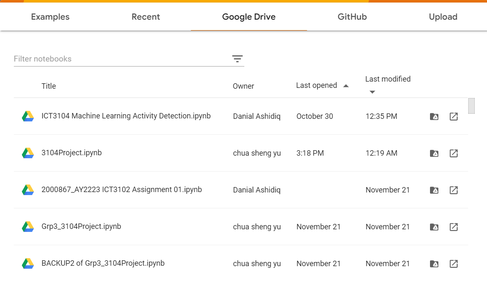
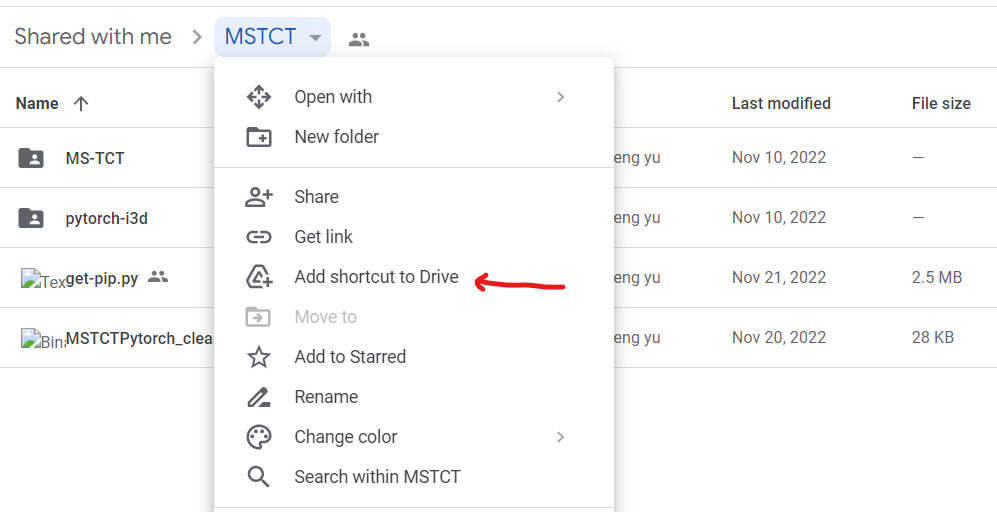
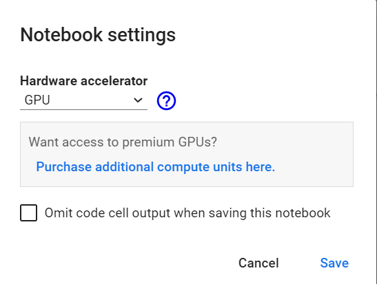

# ICT3104-team03-2022

Toyota Smart Home Project: Using Machine Learning to View Activities in a Home
[](https://colab.research.google.com/drive/1RWC0_zKn77J2JQ3FgpnN-3yYM8_G4NDc?usp=sharing) TSU

NVlabs STEP:  Spatio-Temporal Progressive Learning for Video Action Detection
[](https://colab.research.google.com/drive/1wYctHaCqZjhusdZDGKMTbznpUH-8xd5J?usp=sharing) STEP

MS-TCT : Multi-Scale Temporal ConvTransformer for Action Detection
[](https://colab.research.google.com/drive/15pbIxBEK0dkYwbQUNChpfZmaaX2xgNO7?usp=sharing) MSTCT

## Set up on Google Colab

### 1. Upload and open 3104Project.ipynb & Grp3_3104Project.ipynb to google colab, ensure it is stored in Google Drive with the root pointing to `drive/MyDrive/Colab Notebooks/` 



### 2. Email [chuashengyu98@gmail.com](mailto:chuashengyu98@gmail.com) for the sharing of folder structures and updated codes.

* For TSU  :
  ```
  - /content/MyDrive/ict3104-team03-2022
  ```

* For STEP : 
  ```
  - /content/MyDrive/NVIDIA_STEP/STEP/
  ```
 
* For MS-TCT:
  ```
  - /content/MyDrive/MSTCT/MS-TCT/
  - /content/MyDrive/MSTCT/py-torchi3d/
  ```
  
 More indepth locations are written in the code.

### 3. Add a shortcutt from the shared folder from google drive to the personal drive



### 4. Run the colab on GPU/TPU with high-ram under `edit > notebook settings`



## References
@article{dai2022toyota,
  title={Toyota smarthome untrimmed: Real-world untrimmed videos for activity detection},
  author={Dai, Rui and Das, Srijan and Sharma, Saurav and Minciullo, Luca and Garattoni, Lorenzo and Bremond, Francois and Francesca, Gianpiero},
  journal={IEEE Transactions on Pattern Analysis and Machine Intelligence},
  year={2022},
  publisher={IEEE}
}

@inproceedings{cvpr2019step,
   title={STEP: Spatio-Temporal Progressive Learning for Video Action Detection},
   author={Yang, Xitong and Yang, Xiaodong and Liu, Ming-Yu and Xiao, Fanyi and Davis, Larry S and Kautz, Jan},
   booktitle={IEEE Conference on Computer Vision and Pattern Recognition (CVPR)},
   year={2019}
}

@inproceedings{dai2022mstct,
    title={{MS-TCT: Multi-Scale Temporal ConvTransformer for Action Detection}},
    author={Dai, Rui and Das, Srijan and Kahatapitiya, Kumara and Ryoo, Michael and Bremond, Francois},
    booktitle={CVPR},
    year={2022}
  }
  

